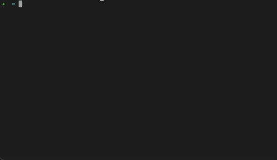

<p align="center">
  <a href="https://github.com/marodev/EagleRepair"></a>
</p>

<p align="center">
    <em>EagleRepair is a cross-platform command line tool for automatically fixing static analysis warnings in C# programs.</em>
</p>

<p align="center">
    <a href="https://github.com/marodev/EagleRepair/actions/workflows/ci.yml">
      
    </a>
    <a href="https://codecov.io/gh/marodev/EagleRepair">
      
    </a>
    <a href="https://www.nuget.org/packages/EagleRepair.Cli">
     
    </a>
    <a href="https://github.com/marodev/EagleRepair/actions/workflows/codeql-analysis.yml">
       
    </a>
    <a href="https://github.com/marodev/EagleRepair/blob/main/.github/dependabot.yml">
       
    </a>
    <a href="https://github.com/marodev/EagleRepair/blob/main/LICENSE">
      
    </a>
</p>

---

**Documentation**: <a href="https://marodev.github.io/EagleRepair" target="_blank">https://marodev.github.io/EagleRepair</a>

**Source-Code**: <a href="https://github.com/marodev/EagleRepair" target="_blank">https://github.com/marodev/EagleRepair</a>

---

## Install

### Prerequisites
Install [.NET 6.0](https://dotnet.microsoft.com/en-us/download/dotnet/6.0) or later

### Command line tool
EagleRepair is [available on NuGet](https://www.nuget.org/packages/EagleRepair.Cli) and can be installed as a global tool:
```
dotnet tool install --global EagleRepair.Cli
```

 

## Getting Started
- first build your C# project
- run EagleRepair

and specify the target rules (e.g, rule R5):
```
eaglerepair -r R5 -p .
```
where "." looks for a solution file (.sln) in the current folder (default if not provided)

## Contributing

PR's are welcome!
Start here: [CONTRIBUTING.md](CONTRIBUTING.md)

